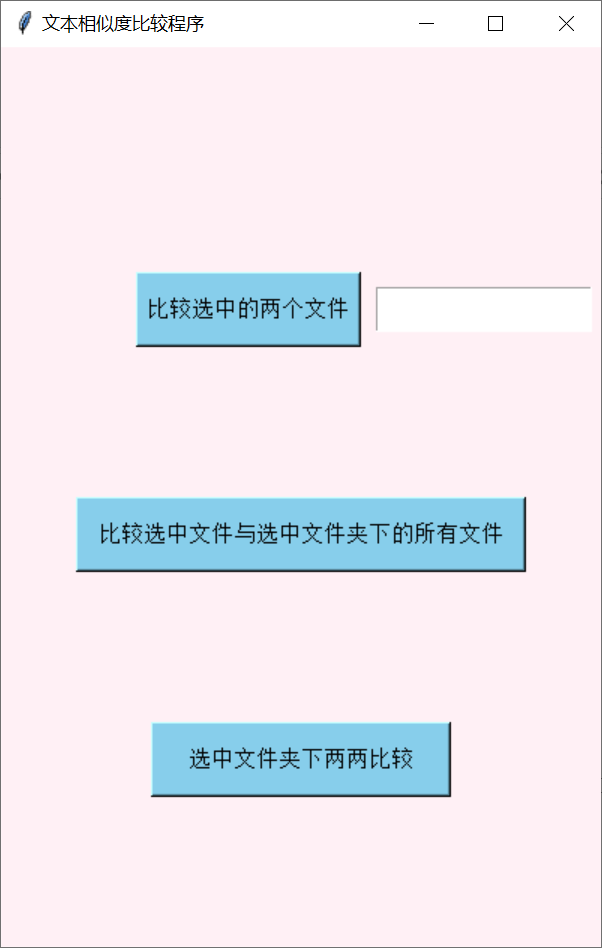

# 文本相似度检测

使用的方法为余弦相似度，将每一个功能拆分为一个单独的程序文件，通过组合的方式构建出计算相似度的程序，因为使用的是Python自带的GUI库tkinter，这个GUI库并不是多线程的，是单线程的，所以在计算相似度的时候窗口可能会卡住。



## 使用方法

创建虚拟环境，进入虚拟环境之后执行以下命令安装好依赖包

```bash
pip install -r requirements.txt
```

执行`python start.py`命令就可以看到窗口。

- 比较选中的两个文件
  - 点击按钮之后会弹出一个文件选中窗口，可以指定文件类型，默认是word文件。
  - 选择完一个文件之后会接着弹出另一个窗口，选择第二个文件。
  - 文件选择完成后会进行相似度的比较，两个文件的比较结果会显示在按钮后方的text框中
- 比较选中文件与选中文件夹下所有文件
  - 点击按钮之后第一个弹出的窗口是选择文件的窗口
  - 文件选择完成之后弹出的窗口是选择文件夹的窗口
  - 文件和文件夹选择完成之后会进行相似度的比较，比较结果会存放在`相似度结果.xlsx`文件中
- 选中文件夹下两两比较
  - 点击之后会弹出选择文件夹的窗口，文件夹选择完成之后就会计算文件之间的相似度
  - 比较结果会存放在`相似度结果.xlsx`文件中

所有比较过程和操作过程均会在IDE的控制台或者命令行窗口输出log

如果没有选择文件夹或者文件那么程序就会退出

## [log.py](./log.py)

这是日志程序，里面自定义了一个logger，记录操作的日志信息，执行`get_logger()`方法将返回一个logger

## [create_window.py](./create_window.py)

这个Python文件中维护了一个`Window`类，这个类实例化之后使用`show()`方法会将窗口显示出来，这个窗口有三个模式可以选择，这个类是用于实现基本的窗口。

## [traverse_folder.py](./traverse_folder.py)

这个Python文件中维护了一个`Traverse`这个类实例化的时候需要指定文件夹路径，这个类的`traverse()`方法会找出实例化这个类时传入的文件夹路径下的所有`docx`、`pdf`、`txt`结尾的文件，然后返回一个生成器对象，这个生成器对象中的内容为符合条件的文件路径


## [reader_source.py](./reader_source)

这个Python文件中维护了四个类和一个`read()`函数，包含一个抽象基类`Reader`，读取txt，word，pdf的三个类都继承自`Reader`类，调用`read()`函数就能实现读取指定类型的文本

## [split.py](./split.py)

这个Python文件中维护了一个Splitter类，这个类用于分割文章和分割句子，提取关键词，实例化这个类之后，调用`split()`方法并传入一段文字内容就能进行分割了，这个`split()`方法会返回一个嵌套列表`List[List[str]]`，内层的每个列表为一句话分割后的结果。

## [processing.py](./processing.py)

这个Python文件中维护了一个`Process`类，这个类组合了前面的`read`函数和`Splitter`类，只需要传入文件路径就能得到文章每一句的关键词

## [sim.py](./sim.py)

这个Python文件中有一个`CosSim`类，这个类用于计算传入的两个列表的相似度，实例化这个类后，调用`sim()`方法并传入两个列表参数，这两个列表参数形式必须为`List[str]`，这一步已经由`Splitter`类完成。

因为算法为手动构建的算法，所以精确度相比于第三方包如`sklearn`、`gensim`得出的结果要差，这个类首先会构建一个词袋，然后将传入的包含词组的列表转换为词向量，然后计算返回相似度。

## [save_similarity.py](./save_similarity.py)

这个Python文件中维护了一个`XLSX`类，调用这个类的`save_excel()`方法可以将得出的相似度存储为excel文件

## [start.py](./start.py)

这个Python文件中维护了一个`Controller`类，这个类继承自`Window`类，通过组合的方式将前面的工具类组合到这个类中。

